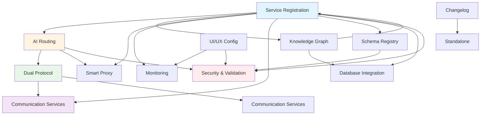

# Feature Map - Coordinator Service

**Last Updated:** 2025-01-XX

---

## Dependency Graph

---

## Feature Matrix

| # | Feature | Status | Files | LOC | HTTP Endpoints | gRPC Methods | Dependencies In | Dependencies Out |
|---|---------|--------|-------|-----|----------------|--------------|------------------|-------------------|
| 01 | Service Registration | ✅ Active | 4 | ~813 | 8 | 0 | 7 | 3 |
| 02 | AI-Powered Routing | ✅ Active | 3 | ~655 | 3 | 0 | 3 | 2 |
| 03 | Dual Protocol | ✅ Active | 6 | ~1,086 | 1 | 1 | 1 | 6 |
| 04 | Knowledge Graph | ✅ Active | 2 | ~518 | 4 | 0 | 0 | 2 |
| 05 | Schema Registry | ✅ Active | 2 | ~601 | 5 | 0 | 0 | 2 |
| 06 | System Changelog | ✅ Active | 2 | ~377 | 4 | 0 | 0 | 1 |
| 07 | UI/UX Configuration | ✅ Active | 2 | ~218 | 2 | 0 | 0 | 2 |
| 08 | Smart Proxy | ✅ Active | 2 | ~329 | 1* | 0 | 0 | 2 |
| 09 | Monitoring | ✅ Active | 4 | ~311 | 2 | 0 | 2 | 2 |
| 10 | Communication Services | ✅ Active | 2 | ~956 | 0 | 0 | 1 | 5 |
| 11 | Security & Validation | ✅ Active | 3 | ~275 | 0** | 0 | 8 | 1 |
| 12 | Database Integration | ✅ Active | 1 | ~33 | 0 | 0 | 2 | 0 |

*Catch-all route  
**Middleware (applies to all)

**Total:** 12 features, 33 files, ~5,772 LOC, 23 HTTP endpoints, 1 gRPC method

---

## Feature Dependencies

### Service Registration (Most Dependent Upon)
- Used by: AI Routing, Dual Protocol, Knowledge Graph, Smart Proxy, Monitoring, Communication Services, Schema Registry
- Dependencies: Database Integration, Knowledge Graph (circular), Security & Validation

### AI-Powered Routing (Core Routing Logic)
- Used by: Dual Protocol, Smart Proxy, Communication Services
- Dependencies: Service Registration, Security & Validation

### Dual Protocol (Infrastructure)
- Used by: Communication Services
- Dependencies: AI Routing, Service Registration, Communication Services, Monitoring

### Communication Services (Protocol Abstraction)
- Used by: Dual Protocol
- Dependencies: Dual Protocol (gRPC client), Monitoring, AI Routing, Service Registration

### Security & Validation (Cross-Cutting)
- Used by: All features (via middleware)
- Dependencies: Logger only

---

## Feature Categories

### Core Features (Essential)
1. Service Registration & Management
2. AI-Powered Routing
3. Dual Protocol Support

### Supporting Features (Enhancement)
4. Knowledge Graph
5. Schema Registry
6. Smart Proxy
7. Communication Services

### Infrastructure Features (Foundation)
8. Monitoring & Observability
9. Security & Validation
10. Database Integration

### Utility Features (Optional)
11. System Changelog
12. UI/UX Configuration

---

## Feature Complexity

| Complexity | Features | Description |
|------------|----------|-------------|
| **High** | Communication Services, Dual Protocol, Service Registration | Complex logic, multiple dependencies |
| **Medium** | AI Routing, Knowledge Graph, Schema Registry | Moderate complexity, some dependencies |
| **Low** | Changelog, UI/UX, Database Integration | Simple logic, minimal dependencies |

---

## Feature Maturity

| Maturity | Features | Notes |
|----------|----------|-------|
| **Production Ready** | All 12 features | All features are active and tested |
| **Partial Implementation** | Security & Validation | JWT is placeholder, validation complete |
| **Optional** | Database Integration | Works with or without Supabase |

---

## Integration Points

### High Integration
- **Service Registration** ↔ **Knowledge Graph** (circular, lazy loaded)
- **AI Routing** ↔ **Smart Proxy** (routing logic)
- **Dual Protocol** ↔ **Communication Services** (protocol abstraction)

### Low Integration
- **Changelog** (standalone)
- **UI/UX Configuration** (standalone)
- **Database Integration** (optional config)

---

## Feature Evolution

### v1.0 (Current)
- All 12 features implemented
- Basic functionality complete
- Production ready

### v1.1 (Planned)
- Enhanced JWT implementation
- Advanced caching
- Rate limiting

### v2.0 (Future)
- Load balancing
- Canary deployments
- Auto-schema learning

